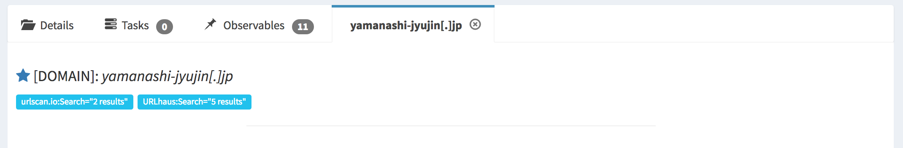
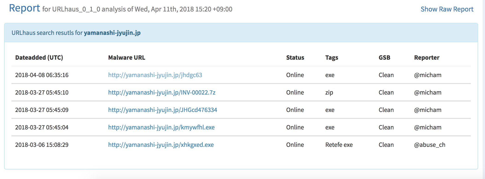

# Cortex URLhaus Analyzer

Cortex analyzer for URLhaus.

## How to install

- Copy `URLhaus` directory to `/path/to/analyzers/`.
- Run `pip3 install -r requirements.txt`.
- Set templates(`templates/long.html` and `templates/short.html`) via TheHive Web UI.

## Screenshots

**short.html**

**long.html**

